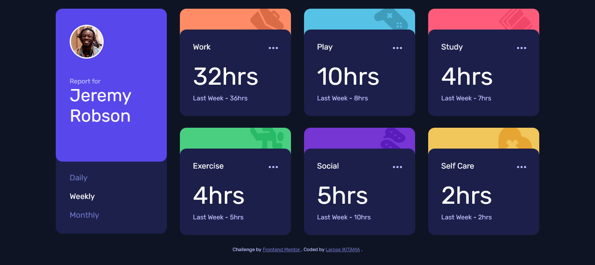

# Frontend Mentor - Time tracking dashboard solution

This is a solution to the [Time tracking dashboard challenge on Frontend Mentor](https://www.frontendmentor.io/challenges/time-tracking-dashboard-UIQ7167Jw). Frontend Mentor challenges help you improve your coding skills by building realistic projects. 

## Table of contents

- [Frontend Mentor - Time tracking dashboard solution](#frontend-mentor---time-tracking-dashboard-solution)
  - [Table of contents](#table-of-contents)
  - [Overview](#overview)
    - [The challenge](#the-challenge)
    - [Screenshot](#screenshot)
    - [Links](#links)
  - [My process](#my-process)
    - [Built with](#built-with)
    - [What I learned](#what-i-learned)
  - [Author](#author)

## Overview

### The challenge

Users should be able to:

- View the optimal layout for the site depending on their device's screen size
- See hover states for all interactive elements on the page
- Switch between viewing Daily, Weekly, and Monthly stats

### Screenshot



### Links

- Solution URL: [GitHub Repository](https://github.com/ikitamalarose/time-tracking-dashboard-challenge.git)
- Live Site URL: [Go to the site](https://time-tracking-dashboard-challenge-sooty.vercel.app/)

## My process

### Built with

- Semantic HTML5 markup
- CSS custom properties
- Flexbox
- CSS Grid
- JavaScript

### What I learned

```html
    <script defer src="/main.js" type="module"></script>
```

```js
fetch('/data.json')
    .then(response => response.json())
    .then(data => {

      console.log(data);
    })
    .catch(error => console.error('Error fetching the JSON data:', error));
});
```

## Author

- Frontend Mentor - [@ikitamalarose](https://www.frontendmentor.io/profile/ikitamalarose)
- GitHub - [@ikitamalarose](https://github.com/ikitamalarose)
- Twitter - [@ikitamalarose](https://www.twitter.com/ikitamalarose)
- Email - [laroseikitama@gmail.com](mailto:laroseikitama@gmail.com)

